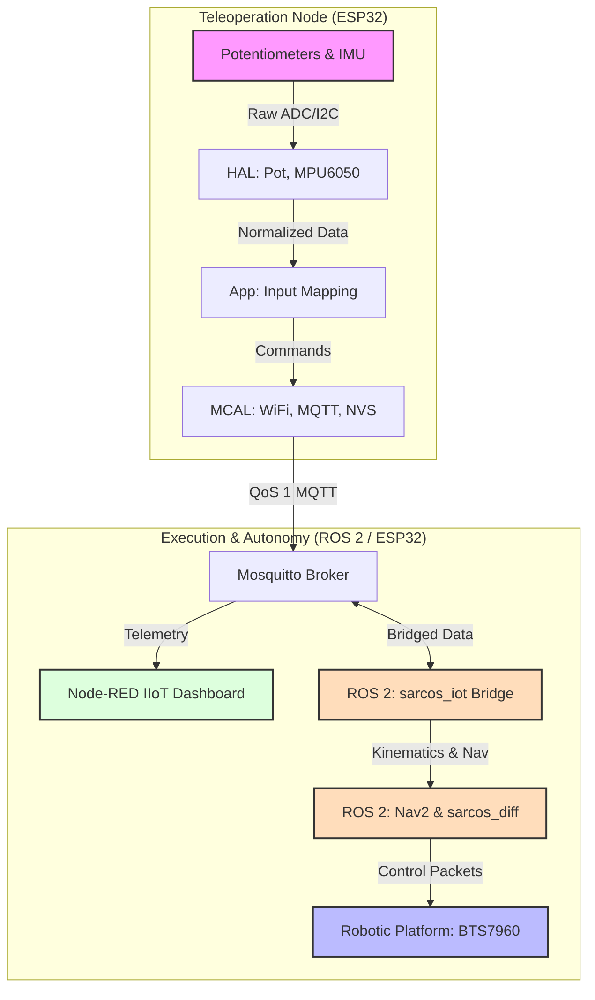

<div align="center">
  
  <h1>SarcoOS</h1>
  <p><strong>Elite Modular RTOS Framework for Teleoperation & Robotics</strong></p>

  [](https://opensource.org/licenses/MIT)
  [](https://www.espressif.com/en/products/socs/esp32)
  [](https://docs.espressif.com/projects/esp-idf/en/latest/esp32/)
  [](https://nodered.org/)
  [](https://docs.ros.org/en/humble/)
</div>

---

## 📖 Project Essence

**SarcoOS** is a high-performance, modular firmware ecosystem designed to synchronize human kinetic movement with robotic precision. Developed with an emphasis on **Industrial IoT (IIoT)** standards, it facilitates a seamless teleoperation experience through a robust **ESP32-based suit** that communicates over a distributed MQTT mesh.

This repository serves as a complete solution—encompassing **Low-Level Embedded C++**, **Precision CAD Design**, **Interactive HMI Dashboards**, and **High-Level ROS 2 Autonomy**.

---

## 📁 Repository Structure

- `3d Desgin/` & `sarcos_design/`: CAD models and SolidWorks assemblies for the robotic platform and wearable suit.
- `PCB_Design/`: KiCad project files for the custom control hardware, including schematics and PCB layouts.
- `code/esp32_driver/`: ESP-IDF based firmware implementing the modular HAL/MCAL architecture.
- `code/node_red_HMI_IIot/`: Node-RED flows for the teleoperation dashboard (`inputs.json` & `outputs.json`).
- `code/ROS_WS/`: ROS 2 workspace integrating high-level autonomy, navigation, and IoT bridging.
- `docs/`: Technical manuals, software documentation, and AI prompts.
- `pdf/`: Compiled PDF datasheets, structural design documents, and humanoid robotics research.
- `Videos/`: Demonstrations and operational footage of the SarcoOS system.

---

## 🏗️ System Architecture & Data Orchestration

SarcoOS is built on a strict **HAL/MCAL (Hardware/Microcontroller Abstraction Layer)** hierarchy, ensuring that high-level robotic logic remains decoupled from the underlying silicon, while natively integrating with **ROS 2** for autonomy.

### 🔌 Real-Time Telemetry Flow
Data originates from physical sensors on the operator's suit and is dispatched through a deterministic processing pipeline.



---

## ⚙️ Engineering Deep-Dive

### 🏎️ Firmware Engineering (ESP-IDF)
The firmware is structured to support complex robotics tasks with minimal overhead.

*   **HAL (Hardware Abstraction Layer)**:
    - **BTS7960**: High-current DC motor driver.
    - **MPU6050**: 6-DOF Inertial Measurement Unit (IMU).
    - **PID Control**: Closed-loop regulation for precise positioning.
    - **TCRT5000**: Infrared sensors for line/position detection.
    - **Ultrasonic (HC-SR04)**: Distance measurement for obstacle avoidance.
    - **Servo/PWM**: Precision angle control for robotic joints.
    - **Potentiometer**: Analog input mapping for suit joints.
    - **DC Motor**: Generic motor control layer.
    - **LED & Button**: Basic HMI and status indicators.
*   **MCAL (Microcontroller Abstraction Layer)**:
    - **MQTT Client**: QoS-aware asynchronous messaging.
    - **WiFi**: Robust connectivity management.
    - **NVS (Non-Volatile Storage)**: Calibration and state persistence.
    - **UART**: Serial communication for debugging and peripherals.

### 🤖 High-Level Robotics & Autonomy (ROS 2)
The SarcoOS system natively supports ROS 2 for advanced kinematics, path planning, and autonomous operation. The workspace is located in `code/ROS_WS/src`:
*   **`sarcos_description`**: Contains the URDF (Unified Robot Description Format) and 3D kinematic model representations.
*   **`sarcos_diff`**: Implements the differential drive hardware interface and controller logic for the robotic base.
*   **`sarcos_iot`**: An intelligent ROS 2 to MQTT bridge, enabling bidirectional communication between the ESP32 distributed network and the high-level ROS graph.
*   **`sarcos_nav`**: Integrates the Navigation2 (Nav2) stack for autonomous navigation, dynamic obstacle avoidance, and SLAM mapping.

### 📐 Mechanical & Electronic Design
- **SolidWorks (Mechanical)**: Detailed assemblies in `sarcos_design/` and `3d Desgin/` featuring high-torque motor mounts, 65mm tires, and the modular teleoperation suit frame. Detailed structural design PDFs are located in `pdf/`.
- **KiCad (Electronic)**: Custom PCB designed to interface ESP32 with various drivers (TMC2209 compatible), featuring optimized power distribution for high-current motors.
- **Technical Manuals**: Comprehensive guides available in [docs/SarcoOS_Technical_Manual_v1.0.docx.pdf](file:///home/ziad/ziad_ws/sarcoos_project/docs/SarcoOS_Technical_Manual_v1.0.docx.pdf).

### 📊 IIoT Dashboard (Node-RED)
The dashboard provides an intuitive interface for mission control:
- **Rover Group**: Real-time directional switches with latency monitoring.
- **Arm Telemetry**: Synchronized gauges and sliders for dual-arm configurations.
- **Gripper Control**: Independent toggle states for precision manipulation.
- **Deployment**: Import `inputs.json` and `outputs.json` directly into your Node-RED instance.

---

## 🛠️ Deployment & Calibration

### 1. Embedded Firmware
```bash
# Clone and setup environment
git clone https://github.com/ziadmohamed0/sarcoos_project.git
cd code/esp32_driver

# Build and flash to ESP32
idf.py build
idf.py -p [PORT] flash monitor
```

### 2. HMI Configuration
- Import both `inputs.json` and `outputs.json` into Node-RED.
- Ensure the MQTT broker URI matches your environment (default: `mqtt://192.168.100.25`).

### 3. ROS 2 Workspace
```bash
# Navigate to the workspace
cd code/ROS_WS

# Build the packages using colcon
colcon build --symlink-install

# Source the overlay
source install/setup.bash

# Run the system (e.g., IoT Bridge)
ros2 launch sarcos_iot iot_bridge.launch.py
```

---

## 🔍 Troubleshooting & FAQ

**Q: ESP32 is flashing but MQTT is not connecting.**  
> **Check**: Verify the WiFi credentials in `main.h`. Ensure your MQTT broker is reachable at the defined IP and port 1883.

**Q: Potentiometer data is jittery.**  
> **Solution**: Check the ADC attenuation settings in the HAL. Ensure sensors have common ground with the ESP32.

**Q: Servo movement is stuttering.**  
> **Solution**: Verify the power supply; servos often require more current than the ESP32 internal regulator can provide.

**Q: ROS 2 nodes aren't receiving MQTT messages.**
> **Solution**: Ensure `sarcos_iot` dependencies (`paho-mqtt` or similar) are installed and the broker IP in the ROS node configuration is accurate.

---

## 🧑‍💻 Technical Leadership

**Ziad Mohammed Fathy**  
*Robotics & Embedded Systems Specialist*  
🔗 [GitHub Profile](https://github.com/ziadmohamed0) | [LinkedIn](https://www.linkedin.com/in/ziad-mohamed-fathy/)

---

## 🛡️ License & Acknowledgements

Authorized under the **MIT License**.  
*Special thanks to the Open Source robotics community for the inspiration behind the modular HAL design.*

> *"Perfection is attained, not when there is nothing more to add, but when there is nothing left to take away."* — Antoine de Saint-Exupéry
