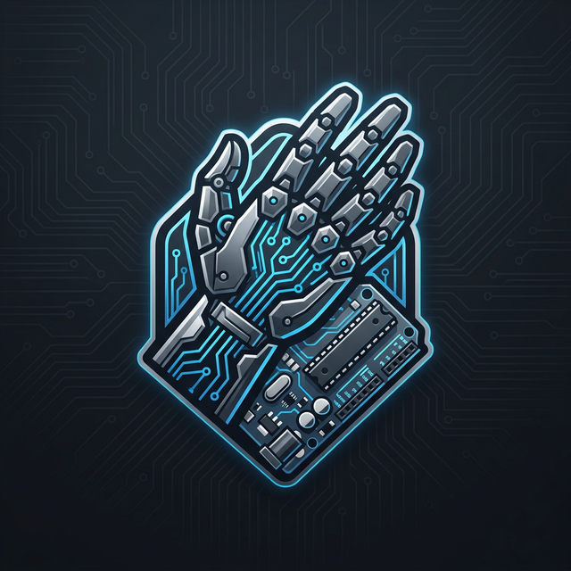
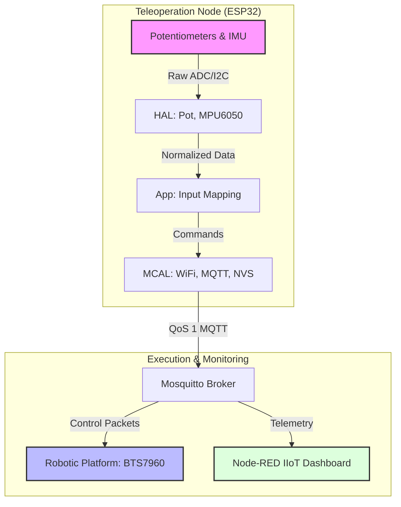

<div align="center">
  
  <h1>SarcoOS</h1>
  <p><strong>Elite Modular RTOS Framework for Teleoperation & Robotics</strong></p>

  [](https://opensource.org/licenses/MIT)
  [](https://www.espressif.com/en/products/socs/esp32)
  [](https://docs.espressif.com/projects/esp-idf/en/latest/esp32/)
  [](https://nodered.org/)
</div>

---

## 📖 Project Essence

**SarcoOS** is a high-performance, modular firmware ecosystem designed to synchronize human kinetic movement with robotic precision. Developed with an emphasis on **Industrial IoT (IIoT)** standards, it facilitates a seamless teleoperation experience through a robust **ESP32-based suit** that communicates over a distributed MQTT mesh.

This repository serves as a complete solution—encompassing **Low-Level Embedded C++**, **Precision CAD Design**, and **Interactive HMI Dashboards**.

---

## 🏗️ System Architecture & Data Orchestration

SarcoOS is built on a strict **HAL/MCAL (Hardware/Microcontroller Abstraction Layer)** hierarchy, ensuring that high-level robotic logic remains decoupled from the underlying silicon.

### 🔌 Real-Time Telemetry Flow
Data originates from physical sensors on the operator's suit and is dispatched through a deterministic processing pipeline.



---

## ⚙️ Engineering Deep-Dive

### 🏎️ Firmware Engineering (ESP-IDF)
The firmware is structured to support complex robotics tasks with minimal overhead.

*   **Peripheral Matrix**: Support for **BTS7960** (High-Current DC), **Servos** (PWM), **MPU6050** (6-DOF IMU), and **TCRT5000** (Infrared Line Detection).
*   **System Services**: Integrated **PID control** loops for precision positioning and **NVS** for persistent calibration data.
*   **Networking**: Non-blocking **MQTT Client** with asynchronous callbacks for bi-directional command handling.

### 📐 Mechanical Kinematics (SolidWorks)
All mechanical components are designed for high-stress robotic applications.
*   **Structural Integrity**: See `Structural Design and Kinematics.pdf` for load bearing and center of mass analysis.
*   **Modular Assemblies**: SolidWorks files in `sarcos_design/` include specific mounts for 65mm tires, high-torque motors, and the teleoperation suit frame.

### 📊 IIoT Dashboard (Node-RED)
The dashboard provides an intuitive interface for mission control:
*   **Rover Group**: Real-time directional switches with latency monitoring.
*   **Arm Telemetry**: Synchronized sliders representing joint angles for dual-arm configurations.
*   **Gripper Control**: Independent toggle states for precision end-effector manipulation.

---

## 🛠️ Deployment & Calibration

### 1. Embedded Firmware
```bash
# Clone and setup environment
git clone https://github.com/ziadmohamed0/sarcoos_project.git
cd code/esp32_driver

# Build and flash to ESP32
idf.py build
idf.py -p [PORT] flash monitor
```

### 2. HMI Configuration
- Import `inputs.json` into Node-RED.
- Ensure the MQTT broker URI matches `mqtt://192.168.100.25` (configurable in `main.h`).

---

## 🔍 Troubleshooting & FAQ

**Q: ESP32 is flashing but MQTT is not connecting.**  
> **Check**: Verify the WiFi credentials in `main.h`. Ensure your MQTT broker is reachable at the defined IP and port 1883.

**Q: Potentiometer data is jittery.**  
> **Solution**: Check the ADC attenuation settings in the HAL. Ensure sensors have common ground with the ESP32.

**Q: Servo movement is stuttering.**  
> **Solution**: Verify the power supply; servos often require more current than the ESP32 internal regulator can provide.

---

## 🧑‍💻 Technical Leadership

**Ziad Mohammed Fathy**  
*Robotics & Embedded Systems Specialist*  
🔗 [GitHub Profile](https://github.com/ziadmohamed0) | [LinkedIn](https://www.linkedin.com/in/ziad-mohamed-fathy/)

---

## 🛡️ License & Acknowledgements

Authorized under the **MIT License**.  
*Special thanks to the Open Source robotics community for the inspiration behind the modular HAL design.*

> *"Perfection is attained, not when there is nothing more to add, but when there is nothing left to take away."* — Antoine de Saint-Exupéry
