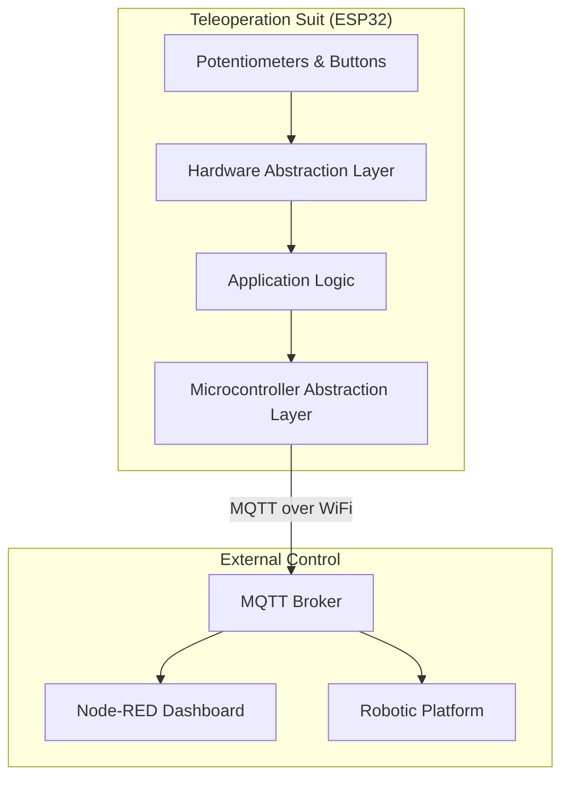

<div align="center">
  
  <h1>SarcoOS</h1>
  <p><strong>Modular RTOS Framework for Teleoperation & Robotics</strong></p>

  [](https://opensource.org/licenses/MIT)
  [](https://www.espressif.com/en/products/socs/esp32)
  [](https://docs.espressif.com/projects/esp-idf/en/latest/esp32/)
</div>

---

## 📖 Overview

**SarcoOS** is an advanced, modular firmware framework designed to bridge the gap between human motion and robotic execution. Centered around a **Teleoperation Suit**, it leverages a sophisticated **HAL/MCAL architecture** to provide real-time, low-latency control data via MQTT.

Whether you're controlling a multi-DOF robotic arm or a mobile rover, SarcoOS provides the robust foundation needed for precise teleoperation in IoT and Industrial 4.0 environments.

---

## 🏗️ System Architecture

SarcoOS follows a strict layered architecture to ensure portability, maintainability, and real-time reliability.

### 🔌 Data Flow & Connectivity
The diagram below illustrates how sensor data from the teleoperation suit is processed and transmitted to the control ecosystem.



### 📁 Repository Structure

*   **[`code/esp32_driver`](file:///home/ziad/ziad_ws/sarcoos_project/code/esp32_driver)**: The heart of the project. A modular ESP-IDF firmware implementation featuring custom drivers for a wide array of sensors and actuators.
*   **[`sarcos_design`](file:///home/ziad/ziad_ws/sarcoos_project/sarcos_design)**: Precision-engineered SolidWorks CAD files for the physical chassis, joint mounts, and sensor housings.
*   **[`code/node_red_HMI_IIot`](file:///home/ziad/ziad_ws/sarcoos_project/code/node_red_HMI_IIot)**: Industrial IoT dashboards providing real-time telemetry visualization and remote override capabilities.
*   **[`pdf`](file:///home/ziad/ziad_ws/sarcoos_project/pdf)**: Technical schematics, wiring diagrams, and formal project documentation.

---

## 🛠️ Technical Specifications

### 🔬 Firmware Layers (ESP32)

| Layer | Component | Description |
| :--- | :--- | :--- |
| **HAL** | `Potentiometer`, `Button` | High-level API for input capture. |
| **HAL** | `BTS7960`, `Servo`, `Motor` | Precision actuator control and power bridging. |
| **HAL** | `MPU6050`, `Ultrasonic` | Orientation sensing and obstacle detection. |
| **MCAL** | `WiFiManager` | Auto-restarting, station-mode connectivity. |
| **MCAL** | `MQTTClient` | Asynchronous pub/sub with configurable QoS. |
| **MCAL** | `NVS` | Flash-based storage for system parameters. |

### 🛰️ Telemetry Schema (MQTT)

| Topic Path | Description | Data Type |
| :--- | :--- | :--- |
| `arm_right/shoulder[1-2]` | Right arm joint angles | Integer (ADC) |
| `arm_left/elbow`, `arm_left/wrist` | Left arm motion data | Integer (ADC) |
| `move/forward`, `move/left` | Rover directional commands | Boolean (0/1) |
| `gripper/open`, `gripper/close`| End-effector states | Boolean (0/1) |

---

## 🚀 Getting Started

### Hardware Requirements
- **MCU**: ESP32-WROOM-32 or equivalent.
- **Actuators**: BTS7960 Motor Driver, standard PWM Servos.
- **Sensors**: 10k Potentiometers, MPU6050 IMU.

### Development Setup
1.  **Clone the Repository**:
    ```bash
    git clone https://github.com/ziadmohamed0/sarcoos_project.git
    ```
2.  **Configure Build Environment**:
    Ensure [ESP-IDF v5.1+](https://docs.espressif.com/projects/esp-idf/en/latest/esp32/get-started/) is installed.
3.  **Compile & Deploy**:
    ```bash
    cd code/esp32_driver
    idf.py build
    idf.py -p /dev/ttyUSB0 flash monitor
    ```

---

## 🗺️ Roadmap & Future Enhancements

- [ ] **IMU Fusion**: Integrating MPU6050 data for 6-DOF orientation tracking.
- [ ] **PID Tuning HMI**: Real-time PID parameter adjustment via Node-RED.
- [ ] **OTA Updates**: Over-The-Air firmware updates for remote suit maintenance.
- [ ] **ROS2 Integration**: Bridging MQTT data into the ROS2 micro-ros ecosystem.

---

## 🧑‍💻 Maintainer

**Ziad Mohammed Fathy**  
Embedded Systems & Robotics Engineer  
🔗 [GitHub Profile](https://github.com/ziadmohamed0) | [LinkedIn](https://www.linkedin.com/in/ziad-mohamed-fathy/)

---

## 🛡️ License

This project is licensed under the **MIT License**. See the [LICENSE](LICENSE) file for details.

> *"Engineering is not just about making things work; it's about making them elegant, efficient, and extensible."*
